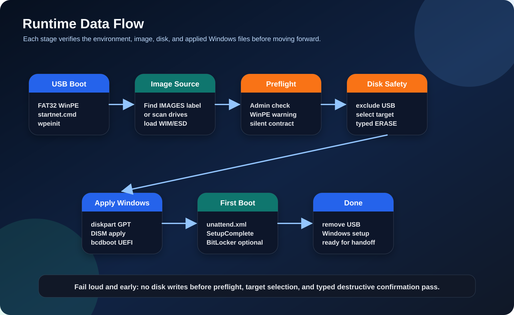
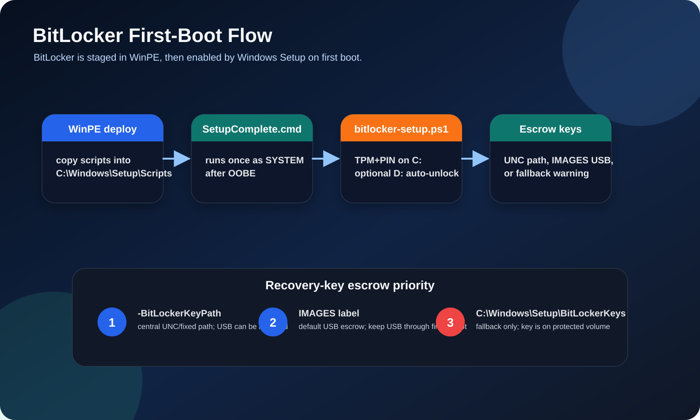
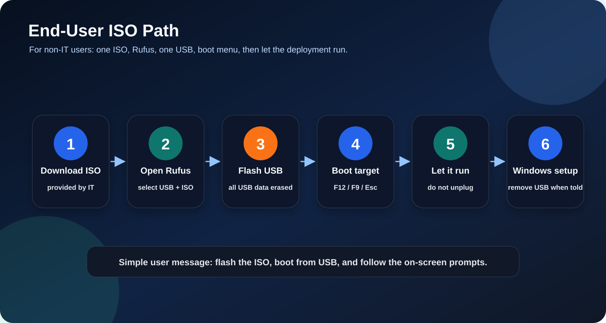

# Visual Assets

This folder adds clean SVG documentation images for the WinPE deployment repo.

These are text-based SVG files so they stay lightweight, source-controlled, diffable, and easy to revise. They are meant to help users understand the repo before reading long command blocks.

## Asset catalog

| Asset | Purpose | Best placement |
|---|---|---|
| `docs/assets/winpe-tool-hero.svg` | Repository hero / overview graphic | Top of `README.md`, after badges and safety warnings |
| `docs/assets/three-loop-workflow.svg` | Shows Loop A/B/C deployment cadence | `README.md` → Workflow Overview |
| `docs/assets/usb-layout.svg` | Explains the dual-partition USB layout | `README.md` → USB Drive Layout; `docs/USB_SETUP.md` before partitioning |
| `docs/assets/runtime-data-flow.svg` | Explains boot-to-deploy runtime flow | `docs/ARCHITECTURE.md` → Runtime Data Flow |
| `docs/assets/target-disk-layout.svg` | Shows GPT/UEFI target disk partitions | `README.md` → Disk Partition Layout on Target |
| `docs/assets/safety-confirmation-chain.svg` | Explains destructive typed confirmations | `README.md` → Safety Features; `docs/ARCHITECTURE.md` → Safety Model |
| `docs/assets/bitlocker-first-boot-flow.svg` | Shows SetupComplete/BitLocker/escrow behavior | `docs/BITLOCKER.md` → How the first-boot stage works |
| `docs/assets/end-user-rufus-flow.svg` | Plain-English ISO-to-Rufus-to-USB user flow | `docs/END_USER_DEPLOY.md`, near the top |
| `docs/assets/winpe-tui-mockup.svg` | Synthetic operator console preview | `README.md` → Loop C or `docs/SCRIPT_REFERENCE.md` |

## Suggested Markdown inserts

### README hero

```md
<p align="center">
  
</p>
```

### Workflow Overview

```md

```

### USB Drive Layout

```md

```

### Runtime Data Flow in `docs/ARCHITECTURE.md`

```md

```

### Target Disk Layout

```md

```

### Safety Features

```md

```

### BitLocker guide

```md

```

### End-user deploy guide

```md

```

### TUI mockup

```md

```

## Accuracy note

`winpe-tui-mockup.svg` is a synthetic visual mockup, not a captured production screenshot. Label it that way anywhere it is used.
